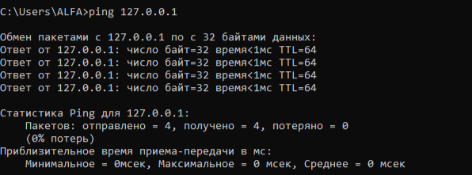
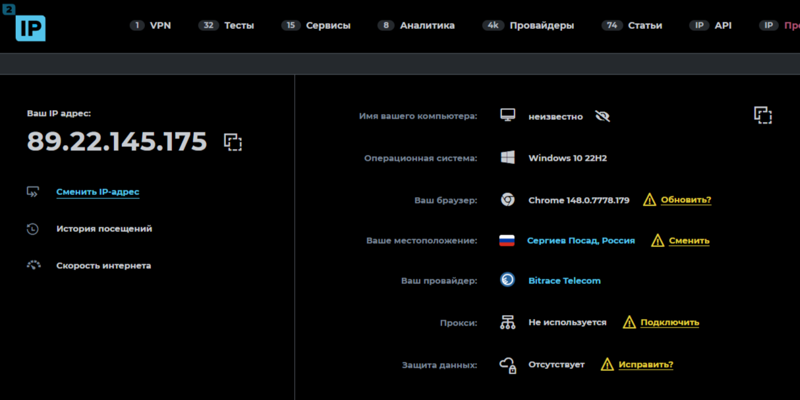

# Лабораторная работа №2
## Изучение программных средств тестирования и определения параметров настройки в компьютерных сетях

**Цель работы:** приобретение знаний и практических навыков в использовании программного обеспечения для настройки и тестирования компьютерной сети.

**Оборудование:** ПК с ОС Windows, локальная сеть с доступом в Интернет.

---

## Задание 1. Определение IP-адреса компьютера

**Команда:** `ipconfig`

**Результат:**

![ipconfig]

**Вывод:** Мой компьютер имеет IP-адрес `192.168.0.189` в локальной сети.

---

## Задание 2. Определение имени узла

**Команда:** `hostname`

**Результат:**

**Вывод:** Имя моего компьютера: `DESKTOP-ABC123`

---

## Задание 3. Проверка связи

### 3.1. Тест localhost (`ping 127.0.0.1`)

**Вывод:** Сетевой стек работает корректно.

### 3.2. Тест klgtu.ru (`ping klgtu.ru`)

**Вывод:** Узел доступен, время 28-29 мс.

### 3.3. Тест yandex.ru (`ping yandex.ru`)

**Вывод:** Узел доступен, время 22 мс.

### 3.4. Тест microsoft.com (`ping microsoft.com`)

**Результат:** `При проверке связи не удалось обнаружить узел microsoft.com`

**Вывод:** DNS не разрешил имя, возможно временный сбой.

### 3.5. Непрерывный ping (`ping yandex.ru -t`)

**Вывод:** Отправлено 222 пакета, 0% потерь, среднее время 22 мс.

---

## Задание 4. Трассировка маршрута (`tracert yandex.ru`)

**Вывод:** Маршрут проходит через 9 прыжков. Финальный узел достигнут за 8-9 мс.

---

## Задание 5. ARP-таблица (`arp -a`)

**Вывод:** Основной шлюз (192.168.0.1) имеет MAC-адрес b8-3a-08-24-0d-c0.

---

## Задание 6. Wireless Network Watcher

**Вывод:** Устройство 192.168.0.186 доступно, среднее время 77 мс.

---

## Задание 7. WifiInfoView

**Вывод:** Обнаружено 7 беспроводных сетей.

---

## Задание 8. 2ip.ru

**Вывод:** Публичный IP: XXX.XXX.XXX.XXX, провайдер: [название]

---

## Общий вывод

[вставить текст общего вывода]

---

## Ответы на контрольные вопросы

1. **Формат имени сетевого ресурса:** `\\СЕРВЕР\ПАПКА` (UNC)
2. **Протокол ping:** ICMP (Internet Control Message Protocol)
3. **ipconfig /all:** выводит MAC-адрес, DNS, DHCP
4. **tracert** увеличивает TTL (1,2,3...), **ping** просто отправляет пакеты
5. **Максимум ретрансляций:** `tracert -h 15 yandex.ru`
6. **localhost:** 127.0.0.1, этот же компьютер

---

**Дата выполнения:** XX.XX.2026
**Студент:** [Твоё имя]
