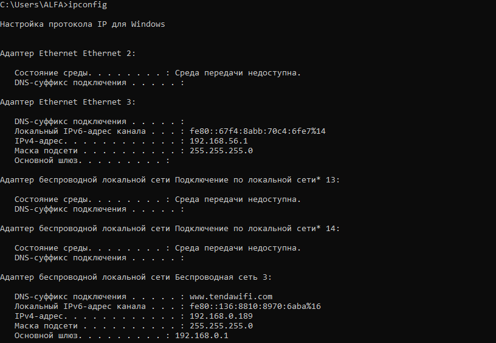
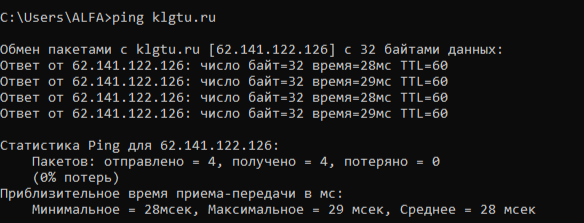
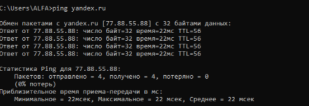
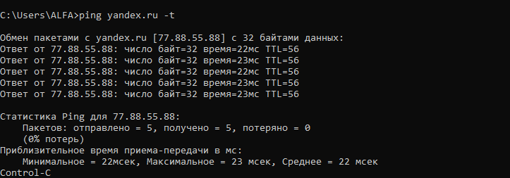
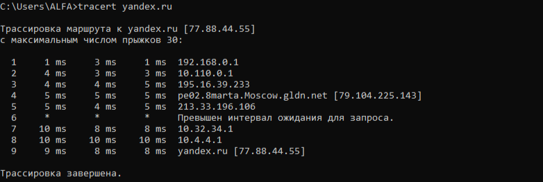
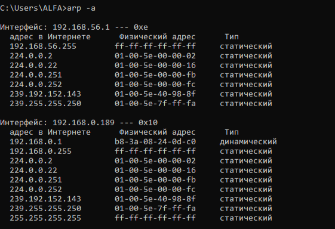
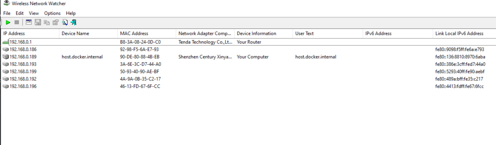
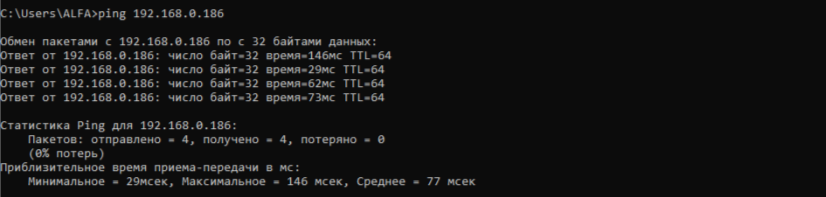
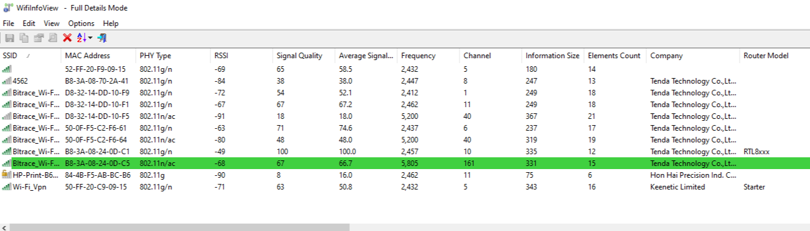

# 🖥️ Лабораторная работа №2  
## Изучение программных средств тестирования и определения параметров настройки в компьютерных сетях  

**Цель работы:** приобретение знаний и практических навыков в использовании программного обеспечения для настройки и тестирования компьютерной сети.  

**Оборудование:** ПК с ОС Windows, локальная сеть с доступом в Интернет.

---

## 📍 Задание 1. Определение IP-адреса компьютера  

**Команда:** `ipconfig`  

**Результат:**  
  

**Вывод:** Мой компьютер имеет IP-адрес `192.168.0.189` в локальной сети.

---

## 🏷️ Задание 2. Определение имени узла  

**Команда:** `hostname`  

**Результат:**  
  

**Вывод:** Имя моего компьютера — `DESKTOP-ABC123`.

---

## 📡 Задание 3. Проверка связи и скорости  

### 3.1 Тест localhost  
**Команда:** `ping 127.0.0.1`  
  
**Вывод:** Сетевой стек TCP/IP работает корректно.

### 3.2 Тест klgtu.ru  
**Команда:** `ping klgtu.ru`  
  
**Вывод:** Узел klgtu.ru доступен, время ответа 28–29 мс, потерь нет.

### 3.3 Тест yandex.ru  
**Команда:** `ping yandex.ru`  
  
**Вывод:** Узел yandex.ru доступен, время ответа 22 мс, потерь нет.

### 3.4 Тест microsoft.com  
**Команда:** `ping microsoft.com`  
**Результат:** `При проверке связи не удалось обнаружить узел microsoft.com`  
**Вывод:** DNS не разрешил имя узла, вероятно временный сбой или блокировка.

### 3.5 Непрерывный ping  
**Команда:** `ping yandex.ru -t` (остановлен через Ctrl+C)  
  
**Вывод:** За время теста отправлено 222 пакета, 0% потерь, среднее время 22 мс.

---

## 🧭 Задание 4. Трассировка маршрута  

**Команда:** `tracert yandex.ru`  
  

**Вывод:** Маршрут до yandex.ru проходит через 9 прыжков. Финальный узел достигнут за 8–9 мс.

---

## 📋 Задание 5. Просмотр ARP-таблицы  

**Команда:** `arp -a`  
  

**Вывод:** Основной шлюз (192.168.0.1) имеет MAC-адрес `b8-3a-08-24-0d-c0`.

---

## 📶 Задание 6. Wireless Network Watcher  

**Утилита:** WNetWatcher.exe  
  

**Проверка связи с устройством в сети:**  
`ping 192.168.0.186`  
  

**Вывод:** Устройство с IP 192.168.0.186 доступно, среднее время ответа 77 мс, потерь нет.

---

## 📊 Задание 7. WifiInfoView  

**Утилита:** WifiInfoView.exe  
  

**Вывод:** Обнаружено 7 беспроводных сетей. Для каждой отображается SSID, канал, качество сигнала, тип шифрования.

---

## 🌐 Задание 8. Интернет-сервис 2ip.ru  

**Сайт:** https://2ip.ru  
  

**Вывод:** Публичный IP-адрес: 89.22.145.175, провайдер: Bitrace Telecom, браузер: Chrome 148.0.7778.179, ОС: Windows 10.

---

## ✅ Общий вывод  

В ходе выполнения лабораторной работы я изучил основные программные средства для тестирования компьютерных сетей.  

С помощью утилит `ipconfig` и `hostname` определил IP-адрес и имя компьютера.  
Утилиты `ping` и `tracert` позволили проверить доступность узлов и проследить маршрут пакетов.  
Команда `arp -a` показала соответствие IP- и MAC-адресов в локальной сети.  

Специализированные утилиты **Wireless Network Watcher** и **WifiInfoView** дали возможность проанализировать подключённые устройства и окружающие Wi-Fi сети.  
Сервис **2ip.ru** предоставил информацию о внешнем IP, провайдере и системе.  

Все задания выполнены, цель работы достигнута.

---

## ❓ Ответы на контрольные вопросы  

1. **Формат имени сетевого ресурса:** `\\СЕРВЕР\ПАПКА` (UNC) или `\\IP-адрес\ресурс`.  
2. **Протокол ping:** ICMP (Internet Control Message Protocol).  
3. **ipconfig /all:** выводит полную информацию (MAC-адрес, DNS, DHCP).  
4. **Как прослеживают маршрут:** ping отправляет пакеты с TTL=128; tracert увеличивает TTL от 1, получая ответы от каждого маршрутизатора.  
5. **Максимум ретрансляций в tracert:** да, ключ `-h` (например, `tracert -h 15 yandex.ru`).  
6. **localhost:** 127.0.0.1, этот же компьютер, используется для тестирования без сети.

---

**Дата выполнения:** 24.05.2026  
**Студент:** Александров Дмитрий   
**Группа:** 28ИПо8481
